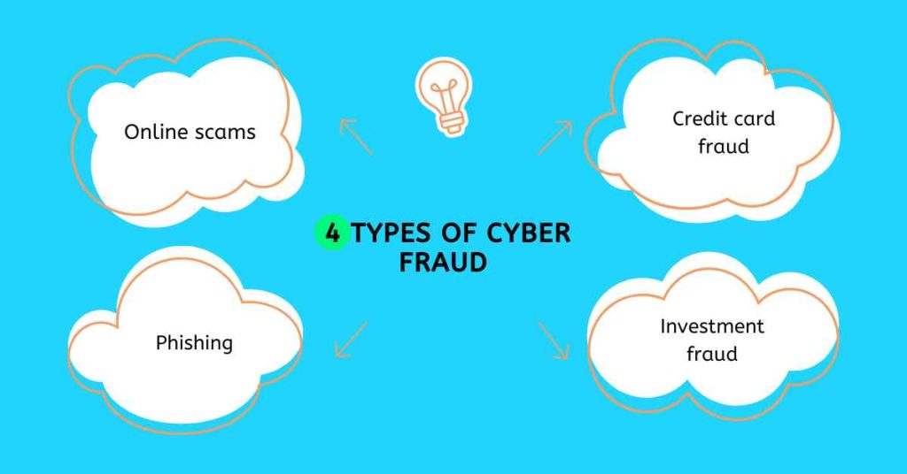

# Furssah-AI-Competition--Tunisia

# 🔐 CYBER-SHIELD INTELLIGENT ASSISTANT
CyberShield Intelligent Assistant is a comprehensive cybersecurity solution that integrates three specialized AI agents: an LLM-powered chatbot for expert consultation, a deep learning-based fraud detection system for real-time threat analysis, and an advanced image analysis engine for visual cybersecurity content processing. Designed for SOC analysts, cybersecurity researchers, and incident response engineers, this system delivers intelligent interaction, automated threat detection, and visual content analysis in a unified platform.
---

🤖 AI Chatbot🛡️ Fraud Detector🔍 Image AnalyzerExpert cybersecurity consultationReal-time threat detectionVisual content analysisCVE analysis & pentesting guidanceNetwork anomaly classificationMalware screenshot analysisInteractive SOC/IR workflowsFraud pattern recognitionSecurity diagram interpretation

---
# AGENT 1: 
# TRAFIC

# TRAFIC DETECTION

# Avec lien

# AGENT 2: 
# CHAT ASSISTANCE 

# AGENT 3: 
# IMAGE TO ANALYSE 
 

# IMAGE ANALYSIS 

# Centré

  

---

## 🚀 Features

🧠 LLM Chat Core — Fine-tuned Qwen-2.5B Instruct using LLaMA Factory, Hugging Face, and Weights & Biases for expert-level cybersecurity assistance (CVEs, pentest guidance, malware behavior, etc.).

📊 Threat Classifier — Hybrid pipeline combining traditional ML models (Decision Tree, Random Forest, SVM, KNN) with deep RNN/LSTM architectures to classify suspicious flows and predict key parameters.

📈 Anomaly Insights — Outputs include:

Risk scores (e.g., 75/100 with confidence)

Detected threats (e.g., port scan, DDoS)

Key anomalies (packet rate, unidirectional flow, uncommon ports)

Actionable recommendations

🖥️ Web-Based Interface — Built with Flask backend and HTML/JavaScript/CSS frontend for a responsive and user-friendly interaction with both the LLM and threat detection modules.

📦 Modular Architecture — Clean project structure separating:

LLM processing

ML threat analysis

File ingestion / pre-processing

Web interface rendering

API routes and communication layers
---

## 📁 Project Structure
<pre>
cybershield-intelligent/
├── app/
│   ├── api/
│   │   ├── chat_handler.py        # Routes for chat (Qwen)
│   │   ├── threat_analyzer.py     # Routes for threat analysis
│   │   └── main.py                # FastAPI or Flask entrypoint
│   ├── llm/
│   │   └── qwen_chat.py           # Inference wrapper for Qwen 2.5B instruct
│   ├── models/
│   │   ├── predictor_rnn.py       # RNN/LSTM inference logic
│   │   ├── preprocess.py          # Input normalization / scaling
│   │   └── model_weights/         # Weights & configs
│   ├── frontend/
│   │   └── streamlit_ui.py        # Chat + Threat Upload UI
│   └── utils/
│       └── helpers.py             # Logging, formatting, scoring utils
├── assets/
│   ├── images/                    # Screenshots et diagrammes
│   └── demo.gif                   # Animation de démonstration
├── data/
│   └── samples/                   # Sample PCAPs / logs / threat flows
├── .env.example                   # Environment variable template
├── .gitignore
├── requirements.txt
├── README.md
└── LICENSE
<pre>
  
---

## 🧪 Quickstart
# 1. Clone the repository
git clone https://github.com/muhammedehab35/FURSSAH_AI_COMETITION-.git
cd cybershield-intelligent

# 2. Install Python dependencies
pip install -r requirements.txt

# 3. Launch the Flask backend
python app/api/main.py

Visit [http://127.0.0.1:8000/docs](http://127.0.0.1:8000/docs) to explore the API via Swagger UI.

---
🧠 LLM Component (Qwen 2.5B Instruct)
Fine-tuned to assist on:

CVEs & exploits

pentesting procedures

malware analysis

SOC/IR workflows

Local or API-based inference (configurable)

---

🛡️ Threat Classification Pipeline
🧩 Models: RNN / LSTM
📥 Input: JSON logs, flow metadata (e.g. NetFlow, Zeek)
📤 Output:

Classification: High | Medium | Low

Threats: e.g. DDoS, Port Scan

Anomalies: abnormal flows, packets per second, unusual ports

Confidence Score & Risk Level

Recommended actions

---

Exemple json output
{
  "type": "suspicious",
  "origin": "laptop",
  "protocol": "TCP",
  "risk_score": "75/100",
  "confidence": "85%",
  "threats": ["port scan", "potential DDoS"],
  "anomalies": [
    "Abnormally high packet rate (500K pps)",
    "Unusual unidirectional flow",
    "Non-standard destination port"
  ],
  "recommendation": "Investigate further"
}
---
🛠 Customization
🔧 Add new detection models or re-train LSTM on new datasets

🧠 Switch or retrain LLM (e.g. with LoRA or QLoRA)

🔌 Extend ingestion to support PCAP, Sysmon, Suricata logs

🔐 Add authentication (OAuth, API key)
---
📦 Dependencies
streamlit, fastapi or flask

transformers, sentence-transformers, llama-cpp-python

scikit-learn, tensorflow or torch

pandas, numpy, matplotlib, aiohttp

dotenv, uvicorn, tqdm
---
📄 License
MIT License — See the LICENSE file.
